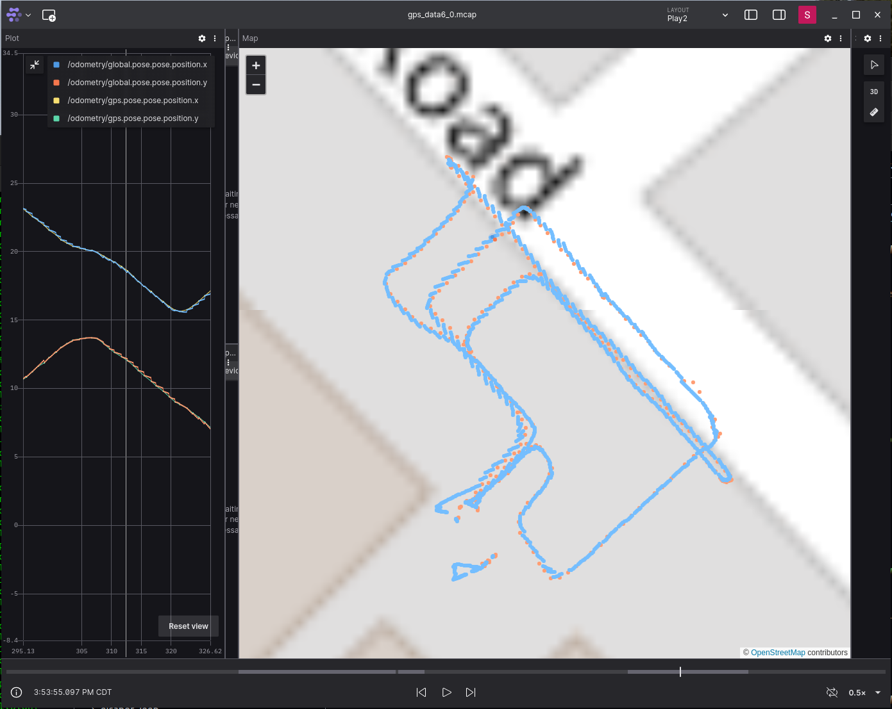

# Elsabot 4WD Robot

ROS2 Humble Support

Top-level bring up scripts for the 4WD base version of the Elsabot robot.  

Some parts of these scripts and configuration files are from the Linorobot2 project:  https://github.com/linorobot/linorobot2

The firmware for the base microcontroller is based on the linorobot2_hardware project.  See this fork for the firmware used for the Elsabot 4WD base (master branch): https://github.com/rshorton/linorobot2_hardware.

</br>

***
## Installation

ROS Humble
* https://docs.ros.org/en/humble/Installation/Ubuntu-Install-Debians.html
    
* The desktop install was used, but a minimal install should work also (and then run RVIZ on your devel computer instead).

Nav2
```
sudo apt install ros-humble-navigation2 ros-humble-nav2-bringup 
```

micro-ROS and agent
* Used the 'Building' steps from https://github.com/micro-ROS/micro_ros_setup/blob/humble/README.md

Other
```
sudo apt install ros-humble-rplidar-ros
sudo apt install ros-humble-laser-filters
sudo apt install ros-humble-joint-state-publisher
sudo apt install ros-humble-rosbridge-suite
sudo apt install ros-humble-robot-localization
sudo apt install ros-humble-joy-linux
sudo apt install ros-humble-imu-filter-madgwick
```
Clone and build:

* Fork of cmd_vel_mux package:  https://github.com/rshorton/cmd_vel_mux


Development Machine
* Installed full ROS Humble install
* Used RVIZ on this machine.

Other Setup on Robot computer

* udev rules, /etc/udev/rules.d/99-usb-serial.rules 

  * SUBSYSTEM=="tty", ATTRS{idVendor}=="16c0",ATTRS{idProduct}=="0483", SYMLINK+="teensy"
  * SUBSYSTEM=="tty", ATTRS{idVendor}=="10c4",ATTRS{idProduct}=="ea60", SYMLINK+="rplidar"
  * See other examples in hwsetup/99-usb-serial.rules.  Some of the rules assign to specific ports since some devices use the same type of USB-to-serial controller that appear identical.

* teleop Controller
  * Bluetooth game controller paired to the robot computer.

<br/>

***
## Running

### Start base functionality using shell 1:

```
ros2 launch elsabot_4wd bringup.launch.py
```    
By default this will also launch joystick teleop so you can use a game controller to manually control the robot.

### Start navigation using shell 2:
```
ros2 launch elsabot_4wd navigation.launch.py
```

### Start RVIZ on development host  
```
rviz2
```
* Use RVIZ to set initial position and then issue nav commands.
  
  <br/>

### Map creation for navigation

Replace navigation.launch.py above with this instead:
```  
ros2 launch elsabot_4wd slam.launch.py rviz:=false
```
Move robot around using telop to build the map, and then save the map using:
```
ros2 run nav2_map_server map_saver_cli -f <path_to/elsabot_4wd/maps/your_map_name> --ros-args -p save_map_timeout:=10000.
```
 Edit launch/navigation.launch.py to use your map (or specify using a launch arg).
 
 <br/>

 ***
## Gazebo Simulation (Using Fortress)

### Start base functionality using shell 1:
```
export IGN_GAZEBO_RESOURCE_PATH=<path_to workspace/src>
ros2 launch elsabot_4wd bringup.launch.py use_gazebo:=True launch_gazebo:=True
```
### Start navigation using shell 2:
```
ros2 launch elsabot_4wd navigation.launch.py use_sim_time:=True
```
### Start RVIZ on development host  

```
rviz2
```

* Use RViz to set the 2D pose estimate.

To run Gazebo with simulated GPS instead of AMCL, revise the launch commands:

```
ros2 launch elsabot_4wd bringup.launch.py use_gazebo:=True launch_gazebo:=True use_gps:=True gps_origin_lat:=<replace with your lat> gps_origin_lon:=<replace with your long> world_sdf_file:=my_empty_world.sdf
ros2 launch elsabot_4wd navigation.launch.py use_sim_time:=True use_gps:=True
```   

No need to set the initial position using Rviz in the GPS case. Be sure to specify your latitude and longitude in decimal degrees.

<br/>

***
## Running the real robot with GPS

### Start base functionality using shell 1:

```
ros2 launch elsabot_4wd bringup.launch.py use_gps:=True use_rtk:=False
```
* Edit the gps.launch.py script to specify the serial port used for your GPS.  If you want to use RTK GPS, then also revise that script to specify the NTRIP specific parameters and then launch with `use_rtk:=True`.

### Start navigation using shell 2:
```
ros2 launch elsabot_4wd navigation.launch.py use_gps:=True
```

### Debugging tips for GPS Related functionality

1. Check the topic `/gps/fix` for the GPS fix status.  See this link for the message fields: http://docs.ros.org/en/api/sensor_msgs/html/msg/NavSatFix.html  In particular check the 'status' field.

2. Make sure the robot has a source for determining its orientation such as an IMU with a magnetometer.  Verify the orientation is being processed correctly by checking the 'orientation' field of the /imu/data topic.  It's a quaternion, so a page like this one is handy for converting the quaternion into understandable Euler rotations:  https://www.andre-gaschler.com/rotationconverter/.  Or, just check the cardinal directions for values close to these:
   * Direction: x, y, z, w
   * East:  0, 0, 0, 1
   * North: 0, 0, 0.707, 0.707
   * West:  0, 0, 1, 0
   * South: 0, 0, -0.707, 0.707

3. Use a program such as Foxglove to visualize a map with the robot position shown. https://foxglove.dev/

4. Be sure to perform a hard-iron calibration of your IMU Magnetometer to improve the measured heading.  See https://learn.adafruit.com/adafruit-sensorlab-magnetometer-calibration/magnetic-calibration-with-jupyter.

### GPS RTK Setup

The NavSpark PX1122R-EVB module was used for both the Base and Rover. (https://navspark.mybigcommerce.com/px1122r-evb-px1122r-multi-band-quad-gnss-rtk-evaluation-board/).  The following describes the various setup steps used.

#### Base Setup

1. Followed the documentation provided with the PX1122R-EVB module to use the Windows application to configure the module for RTK base mode.

2. NTRIP Caster (Functions as a server for providing RTCM data to an NTRIP client running on a Rover.)

   * Installed on Ubuntu 20.04.

   * Used the ntripcaster package, https://github.com/goblimey/ntripcaster.

   * Followed the very well-written ReadMe file to build, configure, and run.

3. NTRIP Server (It is used to read RTCM data from base module and send to the Caster.)

   * Used the RTKLIB package, https://www.rtklib.com. Installed it on the same computer running ntripcaster, using this command:

     ```
     sudo apt install rtklib
     ```

   * Used a TTL-serial-to-USB adapter to read the RTCM data from the base PX1122R-EVB using the TX header pin.  (I chose not to use USB1 for this so I could still connect the Windows app at the same time.) Also installed a jumper in the 'B' position.

   * Ran str2str of RTKLIB to read the RTCM using the serial port (your command will be different):


     ```
     str2str -in serial://ttyUSB0:115200#rtcm3 -out ntrips://:whereswaldo@127.0.0.1:2101/mcktx -t 3
     ```

#### RTK Rover Setup (on the robot)

1. Followed the documentation provided with the PX1122R-EVB module to use the Windows application to configure the module for RTK rover mode.

2. Created the gps.launch.py script to launch the rover-side.  It uses str2str, but in this case it connects to the NTRIP Caster (via Wifi), fetches the RTCM data, and then pushes that to the PX1122R-EVB of the robot (using the USB1 serial port of the module).

#### RTK Testing

Used the Map view of Foxglove to visualize the robot position on a map.  Also used Foxglove to visual a ROS bag capture created with teleop control of the robot (See https://foxglove.dev/docs/studio/connection/ros2, and use mcap to convert the bag):



(Path was offset from the real-world map by approx. 1 meter since the RTK base position hasn't been precisely determined yet. - TODO using NOAA OPUS)


### Establishing the absolute position of the RTK base

I had trouble using NOAA OPUS to calculate the actual position of my RTK base.  As such, I chose to improvise by calibrating the position using landmarks near my house that were clearly delineated in Google Earth (satellite view).  Here's the general procedure I used:

1. Used the procedure provided with the GPS software to get an approximate RTK base fix.

2. Identified a nearby location in Google Earth where a driveway intersected the sidewalk.

3. Positioned the robot at that location and recorded the position obtained from RTK.

4. Noted the position of the same location indicted by Google Earth.

5. Used this web site to convert the GPS coordinates to UTM.

6. Calculated the difference in UTM coords between the measured point and the point indicated by Google Earth.

7. Applied that offset to the base position (converted base GPS coords to UTM, applied the correction offset, 
converted back to GPS coords) and then configured the base RTK module to use that corrected GPS position as its location.

I used one point for calculating the offset which was sufficient for my purposes.

### Using Google Earth Pro to visualize robot position

The Google Earth Pro application can be used to visualize the location and orientation of the robot.  To setup:

1. Install Google Earth Pro and start it.

2. Clone and build: https://github.com/rshorton/kml_publisher

3. Follow the directions in the Readme for `kml_publisher` to launch and setup Google Earth Pro to use its output.

4. With the robot nodes running, you should then see an arrow in Google Earth Pro corresponding to the location and orientation of the robot.

### Navigating a sequence of way points selected using Google Earth Pro

These steps use the `elsabot_bt` package to command the Nav2 stack to follow a path defined using Google Earth Pro.

1. Use the `Add Path` tool of Google Earth Pro to define a path of two or more points.

2. Right click the path as listed in the `Places` list and save as a `KML` file ***(not KMZ)***.

3. Edit the behavior tree file `bt_xml/bt_test_gps_waypoint_nav.xml` of the `elsabot_bt` package to specify the KML file(s) created in step 2.  This is a simple behavior tree that just reads GPS points of a KML path file, converts to robot relative positions, and then commands Nav2 to navigate thru those points.  The default file navigates two paths.

4. Run the elsabot_bt node:
   ```
   ros2 launch elsabot_bt elsabot_bt.launch.py use_sim_time:=False only_bt:=True bt_xml:=<full path to bt_test_gps_waypoint_nav.xml> bt_use_std_out_logger:=True log_level:=info
   ```


